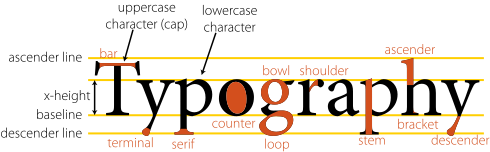

# Liberation-Sans

Liberation Sans designed by Steve Matteson, Ascender Corporation
 
Red Hat licensed these fonts from Ascender Corp under 

- SIL Open Font License (version 2 onwards)[1]
- GPL font exception (older versions)[2]

This web compatible woff2 font collection and stylesheet are provided by
Thorsten Lorenz, coseos.com with respect to the original license.

ttf, eot, and woff font files are provided in separate folders.

Typography Clip Art [3]

[1] [https://openfontlicense.org/](https://openfontlicense.org/)

[2] [https://www.gnu.org/licenses/gpl-faq.html](https://www.gnu.org/licenses/gpl-faq.html#FontException)

[3] [https://www.clker.com/clipart-typography.html](https://www.clker.com/clipart-typography.html)

